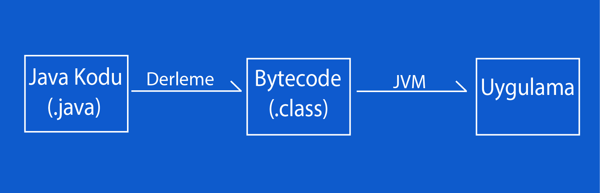
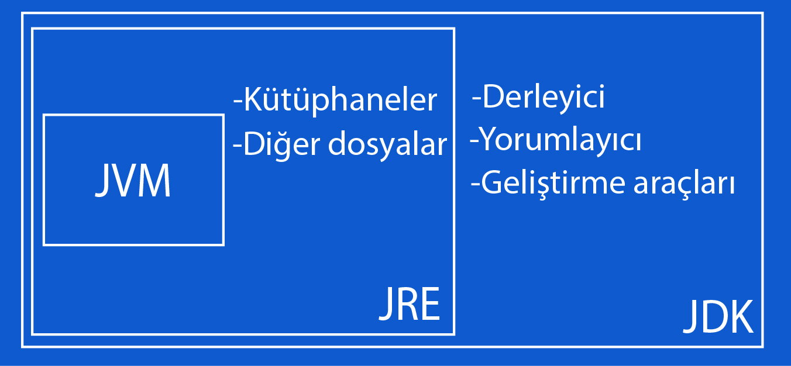

## Week 01

- [JVM nedir, ne işe yarar?](#jvm-nedir-ne-işe-yarar)
- [JDK nedir, ne işe yarar?](#jdk-nedir-ne-işe-yarar)
- [Garbage Collector'ın görevi nedir, nasıl çalışır?](#garbage-collectorın-görevi-nedir-nasıl-çalışır)
- [.jar formatı nedir?](#jar-formatı-nedir)
- [Javada .class ve .java formatının farkı nedir?](#javada-class-ve-java-formatının-farkı-nedir)
- [Abstract class nedir, nasıl çalışır, ne işe yarar?](#abstract-class-nedir-nasıl-çalışır-ne-işe-yarar)

___

### JVM nedir, ne işe yarar?
**JVM (Java Virtual Machine)**, Java programlama dilinin en önemli özelliklerinden biri olan platform bağımsızlığını sağlayan bileşenidir. Platform bağımsızlığı ile birlikte herhangi bir yerde yazılan Java kodaları, platform (GNU-Linux, Windows, MacOs) fark etmeksizin **JVM** ile çalıştırılabilir.

Java kodları **.java** uzantılı dosyalara yazılır. Bu kodlar derlenerek, **.class** uzantılı dosyalara yazılarak, bytecode’lara dönüştürülür. Bu bytecode’lar da **JVM** aracılığı ile bulunduğu platformda, platformun anlayacağı şekle dönüştürülür ve uygulama çalışır.

Bunun kullanıcıya sağladığı kolaylığı anlamak için şöyle bir örnek verelim; programcının Windows platformu üzerinde yazılım geliştirdiğini varsayalım. Yazdığı Java kodlarının başka bir platform üzerinde, mesela MacOs üzerinde, çalıştırılması gerekiyor. Bu aşamada **JVM** ile programcı, herhangi bir sorun yaşamıyor ve Windows üzerinde yazdığı Java kodlarını MacOs üzerinde çalıştırabiliyor.



___

### JDK nedir, ne işe yarar?

**JDK (Java Deveplopment Kit)**, Java uygulamalarını geliştirmek için gerekli olan bileşenleri içeren bir pakettir. Bu paketin içerisinde **JRE (Java Runtime Environment)**, derleyici, yorumlayıcı ve diğer geliştirme araçları yer alır.

Java kodlarını bytecode’a çeviren bileşene **JRE** denir. **JRE**’nin içerisinde **JVM**, kütüphaneler ve diğer dosyalar yer alır. **JVM**, yukarıda bahsettiğimiz gibi bytecode’a çevirilen Java kodlarını, bulunduğu platform üzerinde çalıştırıyor.

Kısaca **JDK**, Java uygulamaları geliştirirken programcının ihtiyacı olan hemen hemen tüm araç gereçlere sahip bir pakettir. Programcı bu paketin kurulumunu yapmadan Java uygulamaları geliştiremez. Bu yüzden, **JDK**’nın kurulumu gereklidir.



___

### Garbage Collector'ın görevi nedir, nasıl çalışır?

**Garbage Collector (GC)**, JVM’nin içinde yer alan otomatik bellek yönetimi mekanizmasıdır. Kısaca bu işlem, heap belleğe bakıp kullanılan objelerin tespit edilmesi ve referans edilmeyenlerin silinmesidir. Referans edilmeyen, yani kullanılmayan nesnelerin kapladığı alan bellekten boşaltılır ve bellekte boşuna yer kaplamamış olurlar. Bellekteki bu yer boşaltma işini yapan **Garbage Collector**’dur.

Nasıl çalıştığını daha iyi anlayabilmek açısından bir örnek verelim; Java programımız çalışmaya başlasın ve çalışma esnasında **new** operatörü ile bir nesne üretmesi gereksin. Program **heap** belleğe gider ve bellekte yeterli alan olup olmadığını kontrol eder. Eğer yeterli alan varsa referans bellekteki bu yeri gösterir ve nesne oluşur. Eğer bellekte yeterli alan yoksa **Garbage Collector** devreye girer ve uygulamanın ihtiyaç duymadığı, kullanılmayan nesneleri bellekten temizler ve yeni oluşan nesne için bellekte yer açar. Bu açıdan, **Garbage Collector** programımız için çok önemli bir mekanızmadır.

___

### .jar formatı nedir?

**.jar** uzantılı dosyalara, **JAR (Java Archive)** dosyası denir. **JRE** tarafından Java dosyalarını ve bunlara bağlı meta verileri saklayan bir paket dosya formatıdır. Kısaca **JAR** dosyası, içinde Java ile hazırlanmış bir uygulamanın bileşenlerini saklayan arşiv dosyasıdır.

Bu dosya formatının sağladığı kolaylığı şu şekilde ifade edelim. Java ile oluşturulan bir uygulama, **JAR** dosyası yardımı ile sıkıştırılarak arşivlenir.  Böylece uygulamanın bileşenlerini taşıyan tek bir paket dosyası olur. Bu paket dosyasını dilediğiniz gibi paylaşabilir veya depolayabilirsiniz.

___

### Javada .class ve .java formatının farkı nedir?

**JVM**’nin tanımını yaparken bu dosya formatlarından bahsetmiştik. **.java** uzantılı dosyalar, programcının Java programlama dilini kullanarak yazdığı kodu saklar. Diğer bir deyişle, **.java** uzantılı dosyalarda Java programının kaynak kodu yer alır. **.class** uzantılı dosyalarda ise **.java** uzantılı dosyaların derlenmesi ile oluşan bytecode’lar yer alır.

Aralarındaki diğer bir farklılık da Java programlama dilini bilen bir programcı **.java** formatındaki kodu anlayabilir fakat **.class** formatındaki bytecode'u anlayamaz. Ayrıca **.class** formatındaki dosyalar **JVM** ile birlikte platformdan (GNU-Linux, Windows, MacOs) bağımsız bir şekilde çalışabilir. Ama aynı durum **.java** formatındaki dosyalar için geçerli değildir.

___

### Abstract class nedir, nasıl çalışır, ne işe yarar?

Interface’i kullanırken soyut, yani kod bloğu olmayan metodları yazıyorduk ve bu interface’i implement eden her class, bu metodları override ediyordu, yani kendine göre yazıyordu. Mutlaka override edilmesi gereken metodları bir class’ta biriktirip daha sonra bu class’tan alt sınıflara türetmek için abstract class’ı kullanırız. Bu türetme işleminde inheritance’ı kullanırız ve alt sınıf, abstract class’da yer alan abstract metodu mutlaka override etmesi gerekir. Abstract’ların bu yapısı interface ile inheritance yapılarının karması gibi düşünülebilir.

Toparlayacak olursak, alt sınıflar bir metodu mutlaka kendine göre yazmak zorundaysa metodları, abstract class’ın içinde abstract metod olarak tanımlarız. Daha kolay anlaşılabilmesi açısından abstract class’ın kullanıldığı aşağıdaki öreneği inceleyebilirsiniz.

```java
//Uygulamamnın çalıştırıldığı Main class'ı.
public class Main {
    public static void main(String[] args) {

        Hayvan kopek = new Kopek("Köpek"); // "Kopek kopek = new Kopek("Köpek");" şeklinde de yazılabilirdi.

        Hayvan kedi = new Kedi("Kedi"); // "Kedi kedi = new Kedi("Kedi");" şeklinde de yazılabilirdi.

        Kus kus = new Kus("Kuş", 25); /* "Hayvan kus = new Kus("Kuş");" şeklinde de yazılabilirdi fakat "Hayvan kus ..." şeklinde yazıldığı
                                      zaman program hata verecekti ve Kus class'ında tanımlı olan kanatacıklıgı() metodu çalışmayacaktı.*/

        kopek.sesCikar(); // Köpek havlıyor.
        kedi.sesCikar(); // Kedi miyavlıyor.

        kus.sesCikar(); // Kuş cik cik ötüyor.
        kus.kanatAcıklıgı(); // Kuş'un kanat açıklığı 25cm'dir.
    }
}

//Abstract class olarak tanımlanan Hayvan class'ı.
public abstract class Hayvan {

    private String tur;

    public Hayvan(String tur){
        this.tur = tur;
    }

    public String getTur(){
        return tur;
    }

    public void setTur(String tur){
        this.tur = tur;
    }

    abstract void sesCikar();

}

//Hayvan class'ının alt sınıfı olan Kopek class'ı.
public class Kopek extends Hayvan {

    public Kopek(String tur){
        super(tur);
    }

    @Override
    public void sesCikar(){
        System.out.println(getTur() + " havlıyor.");
    }
}

//Hayvan class'ının alt sınıfı olan Kedi class'ı.
public class Kedi extends Hayvan{

    public Kedi(String tur){
        super(tur);
    }

    @Override
    public void sesCikar(){
        System.out.println(getTur() + " miyavlıyor.");
    }
}

//Hayvan class'ının alt sınıfı olan Kus class'ı.
public class Kus extends Hayvan{

    private int kanatAcikligi;

    public Kus(String tur, int kanatAcikligi){
        super(tur);
        this.kanatAcikligi = kanatAcikligi;
    }

    public int getKanatGenisligi(){
        return kanatAcikligi;
    }

    public void setKanatGenisligi(int kanatAcikligi){
        this.kanatAcikligi = kanatAcikligi;
    }

    @Override
    public void sesCikar(){
        System.out.println(getTur() + " cik cik ötüyor.");
    }


    public void kanatAcıklıgı(){
        System.out.println(getTur() + "'un kanat açıklığı " + kanatAcikligi + "cm'dir.");
    }
}
```
