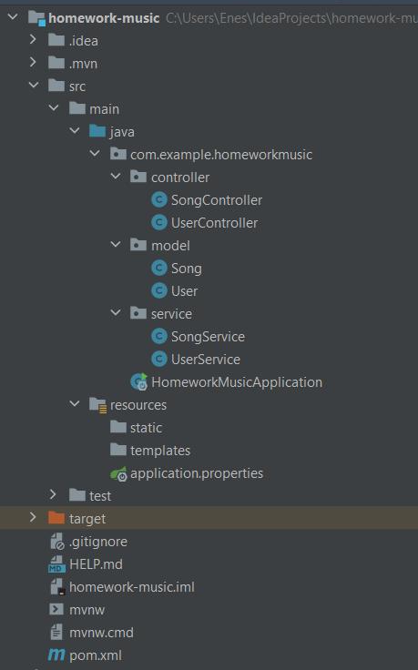

## Week 02

- [Week 02](#week-02)
  - [SOLID nedir? Kısa kısa SOLID prensiplerini kendi yorumlarınızla açıklayınız.](#solid-nedir-kısa-kısa-solid-prensiplerini-kendi-yorumlarınızla-açıklayınız)
    - [**Single Responsibility Principle**](#single-responsibility-principle)
    - [**Open/Closed Principle**](#openclosed-principle)
    - [**Liskov Substitution Principle**](#liskov-substitution-principle)
    - [**Interface Segregation Principle**](#interface-segregation-principle)
    - [**Dependency Inversion Principle**](#dependency-inversion-principle)
  - [Singleton Design Pattern’ı açıklayıp kod ile örnekleyiniz.](#singleton-design-patternı-açıklayıp-kod-ile-örnekleyiniz)
  - [Spring’de application properties nedir? Ne işe yarar?](#springde-application-properties-nedir-ne-işe-yarar)
  - [Bir kullanıcının müzik ekleyebildiği, güncelleyebildiği veya silebildiği bir müzik uygulaması yazın.](#bir-kullanıcının-müzik-ekleyebildiği-güncelleyebildiği-veya-silebildiği-bir-müzik-uygulaması-yazın)

___

### SOLID nedir? Kısa kısa SOLID prensiplerini kendi yorumlarınızla açıklayınız.
**SOLID**; kod tekrarına düşmeden, sürdürülebilir, anlaşılabilir, esnek ve yeniden kullanılabilir yazılımlar geliştirmek için kullanılan prensipler bütünüdür. SOLID’in bünyesinde beş tane prensip yer almaktadır, her birinin baş harfi ile birlikte SOLID kelimesi oluşmaktadır. Bu prensipler ile birlikte **“Spaghetti Code”** denilen karmaşık kodlar yerine, **“Clean Code”** denilen düzenli kodlar yazarız. Böylece geliştirilen uygulama ne kadar büyük olursa olsun, karmaşıklıktan söz edilemez.

SOLID’in bünyesindeki prensipler şu şekildedir;
- **S**ingle Responsibility Principle
- **O**pen/Closed Principle
- **L**iskov Substitution Principle 
- **I**nterface Segregation Principle
- **D**ependency Inversion Principle

#### **Single Responsibility Principle**
Türkçe karşılığı **“Tek Sorumluluk Prensibi”** olan bu prensipte amaç, her method ve class’ın tek bir görevi ve sorumluluğu olmasıdır. Yani bir method’un veya class’ın yapması gereken yalnızca bir işi olması gerekir.

Bir class veya method ne kadar fazla sorumluluk alırsa, o kadar fazla değişime uğramak zorunda kalır. Böylece ilgili kısımda kod değişimi de bir o kadar zorlaşır. Aksi durumda, sorumluluğun azaltılması demek değişime daha kolay adapte olmak demektir.

Tek bir class’ta tek bir sorumluluğun olması programda **bağımlılığı azaltacaktır**. Ayrıca sorumluluğun azaltılması ile birlikte daha yalın ve küçük yapılar oluşur. Böylece kodun **anlaşılırlığı artar**.

#### **Open/Closed Principle**
Bu prensibe göre oluşturulan class’lar veya method’lar **değişikliğe kapalı** fakat **yeni davranışların eklenmesine açık** olmalıdır. Böylece **sürdürülebilir** ve **tekrar kullanılabilir** yapıda kod yazılmış olur.

Bu prensibin isminde yer alan **“Open”** kavramı, class veya method için yeni ihtiyaçlara göre **yeni davranışlar eklenebilir** olmasını ifade eder. **“Closed”** kavramı ise, class veya method’un temel özelliklerinin **değişiminin mümkün olmadığını** ifade eder.

Kısacası, gereksinimlere göre kodun güncellenmesi gerektiği zaman bu güncellemenin koda ekleme yapılarak çözülmesi gerekir. Aksi takdirde her defasında kodu değiştirmek vakit kaybı yaratacaktır ve ileriki süreçlerde işleri çok zorlaştıracaktır. Bundan dolayı sürdürülebilir yapıda kod yazmak için bu prensip oldukça önemlidir.

#### **Liskov Substitution Principle**
Bu prensibe göre kodlarımızda herhagi bir **değişiklik yapmaya gerek duymadan** alt sınıfları, türedikleri üst sınıfların yerine kullanabilmeliyiz. Yani alt sınıflardan oluşan nesnelerin üst sınıfın nesneleri ile yer değiştikleri zaman, aynı davranışı sergilemesi beklenmektedir.

Bu prensipte **genişlemeye açık**, **sürdürülebilir** yapılar söz konusudur. Bu prensibe uygunluk tam olarak sınıflardan beklenen davranışları karşılayabilecek bir hiyerarşi düzeni oluşturarak sınıf yapılarımızı geliştirmektir.

#### **Interface Segregation Principle**
Sorumlulukların hepsini tek bir interface’e toplamak yerine daha özelleştirilmiş birden fazla interface oluşturmayı tercih etmemizi söyleyen prensiptir. Bu prensip, **“Single Responsibility”** prensibi ile aynı amaca hizmet eder. Tek fark **“Single Resposibility”** **class’lar ve method’larla** ilgilenirken, **“Interface Segregation”** **interface’ler** ile ilgilenir. Bunun dışında “Single Responsibility” prensibinde dile getirilen her şey bu prensip için de geçerlidir.

Implement edilen interface’de birden fazla sorumluluk yer alırsa, bu durum uygulanacak class’ta karmaşıklığa ve ihtiyaç duymadığı özellikleri almasına yol açar. Bu yüzden sorumlulukları özelleştirilmiş birden fazla interface’a dağıtmak daha rahat kod yazımını sağlayacaktır. Ayrıca bu prensip, kodun **anlaşılabilir** ve **sürdürülebilir** bir yapıda olmasını sağlayacaktır.

#### **Dependency Inversion Principle**
Bu prensibin temel amacı; sınıflar arası bağımlılıklar olabildiğince az olmalıdır, özellikle üst seviye sınıflar alt seviye sınıflara bağımlı olmamalıdır.

Bu prensip, sınıflar arası bağımlılıkların en az seviyeye indirgenmesi ve bağımlılıkların interface’ler ile kurulması gerektiğine dayanır. Aksi durumda, üst sınıflar alt sınıflara bağımlı kalacak ve alt sınıflarda yapılacak herhangi bir değişikliğin, bağımlılıkları yüzünden üst sınıfları da değişikliğe zorlayacaktır. **“Dependency Inversion”** prensibi bu bağımlılığın tersine çevrilmesini amaçlamaktadır.

**“Dependency Inversion”** prensibi, üst sınıfların alt sınıflara olan bağımlılığını azaltarak **tekrar kullanılabilir** kod parçaları üretmemizi sağlar. Böylece her yapılan değişiklikte kodlarımızı yeniden değiştirmeye gerek kalmıyor ve boşa zaman harcamamış oluyoruz.

___

### Singleton Design Pattern’ı açıklayıp kod ile örnekleyiniz.
**Design pattern**’lar sıklıkla karşılaşılabilecek sorunlara, bu sorunların soyutlanarak tasarlanmış genel çözüm üretirler. **Pattern** demek, aslında bir sorun ve bu sorunun da çözümü demektir. Bu sorunlar da üç ana kategoriye ayrılmış durumdadır.
- Creational Patterns
- Structural Patterns
- Behavioral Patterns

**Creational**; nesne oluşurken sıklıkla bazı problemler ile karşılaşıyoruz ve bu problemlerin genel çözümleri de bu kategoride bulunuyor.

**Structural**; nesneler arasındaki ilişkiler esnasında çıkan problemlere getirilen çözümler de bu kategoride yer alıyor.

**Behavioral**; nesnelerin çalışma zamanında davranışlarında, değişiklik yaparken karşılaşılan problemlere getirilen genel çözümler de bu kategoride bulunuyor.

**Singleton** bir **Creational Design Pattern**’dır. Singleton’ın kelime anlamı **tekil**’dir. Bu isimden de anlaşılacağı üzere ilgili nesneden bir tane olsun istiyorsak **Singleton Design Pattern**’ı kullanabiliriz.

Tek bir nesne oluşturmak için ilgili class’ta private bir constructor oluştururuz. Böylece main class’ında dilediğimiz gibi ilgili class’tan nesne oluşturamayız. Oluşturacağımız nesneyi ilgili class’ta oluşturup bu nesneyi public bir method ile döndürmemiz gerek. Sonuç olarak, tek bir nesne oluşturmuş olacağız ve bu nesneyi main class’ında kullanabileceğiz. Ayrıca bir nesneyi new’lemeden o nesneye ait bir method’u kullanabilmek için method’u static yapmamız gerekir. Static method’lar içinde static değişkenler kullanılabildiği için değişkeni de static olarak tanımlarız.

Daha iyi anlaşılabilmesi için aşağıdaki kodu inceleyebilirsiniz, basit bir **Singleton yapısı** örneği;
```java
public class Singleton {
    private static Singleton singleton = new Singleton();

    private Singleton(){

    }

    public static Singleton getInstance(){
        return singleton;
    }
}
```
**Singlenton class**’ımızı yukarıda da bahsettiğimiz şekilde oluşturduk. **Main class**’ında da şu şekilde çağırdık nesneyi;
```java
public class Main {
    public static void main(String[] args) {
        Singleton singleton = Singleton.getInstance();
				Singleton singleton2 = Singleton.getInstance();
    }
}
```
Main class’ın **singleton** ve **singleton2** nesneleri görünse de aslında ikisi aynı nesneyi ifade eder. Çünkü **Singleton class**’ında oluşturulan nesneyi method’la döndürüyoruz. Onun dışında herhangi bir nesne oluşturulmuyor.

Yukarıdaki **Singleton class**’ında, nesne hiç kullanılmayacak olsa bile bir adet singleton nesnesi oluşturulmuş oluyordu. Kullanılmasını beklemeden class’lar oluşturulurken yapılan bu yüklemeye **“Eager Loading”** denir. Bu da büyük projeler için farklı problemlere neden olabilir. Bu problemleri aşmak için şöyle bir önlem alınabilir; nesne ihtiyaç duyulduğu anda oluşturulabilir ve sonraki ihtiyaçlarda oluşturulan bu nesne kullanılabilir. Yani **“Lazy Loading”** yapılmış olur.

Nesneye ihtiyaç duyulması demek, **Singleton class**’ının içindeki **getInstance()** method’unun çağrılması demektir. Yani nesneyi bu method’un içinde oluşturabiliriz. Ayrıca nesneyi her defasında yeniden oluşturmaktansa var olan bir nesneyi kullanabilmek için **if-else** ile birlikte var olan nesne kontrolü yapılabilir. Aşağıda **Singleton class**’ının **“Lazy Loading”** halini görebilirsiniz.
```java
public class Singleton {
    private static Singleton singleton;

    private Singleton(){

    }

    public static Singleton getInstance(){
        
        if(singleton == null){
            singleton = new Singleton();
        }

        return singleton;
    }
}
```
Böylece **“Lazy Loading”** ile birlikte nesneyi ihtiyacımız olduğu zaman çağırabiliriz.

Biz **tek treat** olarak düşündük ve kodu da ona göre oluşturduk. **Multi-treat** bir ortamda çalışıyorsak ve aynı anda **getInstance()** method’u çağrılırsa ikisi için de **null** olacak ve ikisi de birbirinden ayrı nesneler oluşturabilecek. Bu durumda **Singleton Design Pattern**’a uymamış oluruz.

Bu problemi çözmek için bu method’u **treat-safe** hale getiren **“synchronized”** anahtar sözcüğü vardır. Method’un başına bu anahtar sözcüğü eklersek sorunu çözmüş oluruz.

Aslında sorunu çözsek de programımızın çalışma hızını düşürdük. Treat sayısı arttıkça **“synchronized”** anahtar sözcüğüyle karşılaştıkları zaman treat’ler sıraya girerler. Treat sayısı fazla olunca sıra da uzar ve program yavaşlar. Bunu hızlandırmak için **“synchronized”** sözcüğünden önce **if-else** ile birlikte nesnenin varlığını kontrol edersek programı hızlandırmış oluruz. Kodumuzun **“Lazy Loading”** kullanılan son halini aşağıda görebilirsiniz.
```java
public class Singleton {
    private static Singleton singleton;

    private Singleton(){

    }

    public static Singleton getInstance(){

        if(singleton == null){
            synchronized (Singleton.class){
                if(singleton == null){
                    singleton = new Singleton();
                }
            }
        }

        return singleton;
    }
}
```
Bu ikili null kontrollü tasarım kalıbına **“double-checked locking”** kalıbı denir. Bu kalıp sayesinde hem **“Lazy Loading”** yapmış olduk, hem **treat-safe** çalışmış olduk hem de **maksimum performans** ile bir tasarım yapmış olduk.

___

### Spring’de application properties nedir? Ne işe yarar?
**Application properties**, **Spring Boot**’u isteğimize göre düzelemeye yarar. **Spring Boot** varsayılan özellikleri ile oluşturulur. Programcının mutlaka bu varsayılan ayarlardan bir veya ikisini değiştirmek isteyecektir. Bu değişikliği **“application.properties”** aracılığı ile kolayca yapabilir.

Örnek verecek olursak, **Spring Boot**’un **varsayılan local host’u 8080**’dir. Eğer programcı bunu değiştirmek isterse, **“application.properties”** aracılığı ile **“server.port”** anahtar sözcüğünü kullanarak **server port**’unu değiştirebilir. Mesela server port’unu 8081 yapmak istersek, **“application properties”e** **“server.port=8081”** yazarak server port’unu değiştirebilirler. Böylece varsıyalan **local host**, **8080**’den **8081**’e çevrilir.

___

### Bir kullanıcının müzik ekleyebildiği, güncelleyebildiği veya silebildiği bir müzik uygulaması yazın. 
Eklediği müzikleri çalma listesinde görüntüleyebilsin. Final, static, overload, constructor, encapsulation, List, Set kavramları kullanılmalıdır. Sisteme eklemeler yapabilirsiniz.

Main method’u üzerinde çalışması yeterlidir (İsteyen postman’dan istek atılacak şekilde rest servis yazabilir). SOLID prensiplerine uygun olarak yazmaya çalışınız. Listeleme işlemleri stream kullanılarak yapılmalı.

- Tüm kullanıcıları listeleyin.
- Yeni kullanıcı oluşturulabilsin.
- İsminin içinde “e” harfi olan kullanıcıları listeleyin.
- Tüm müzikleri listeleyin.
- Çalma listesi uzunluğu 10 şarkıyı geçen kullanıcıları listeleyin.
- Kullanıcı, çalma listesinde 20’den fazla şarkı ekleyemesin. (Daha sonraki aşamalarda uygulamaya premium kullanıcı özelliği getirerek geliştireceğiz.)
- Programı katmanlı mimari yapısına uygun yazınız.

Projenin kodlarına geçmeden önce, projede kullanacağımız **“Katmanlı Mimari”**den bahsetmek yerinde olur.

Katmanlı mimari projelerimizde belli bir standart yakalamak ve o standarta göre projeyi geliştirmemizi sağlayan yapıdır. Katmanlı mimari ile geliştirdiğimiz projelerin **kod okunabilirliği** daha yüksek olur.

Katmanlı mimari temelde 3 katmandan oluşur ancak projelerin durumuna göre ara katmanlar da oluşturulabilir.Temel 3 katmanı **"Data Access Layer"**, **"Business Layer"** ve **"Presentation Layer"** olarak söyleyebiliriz.

**“Data Access Layer”** katmanında veriye erişim işlemleri gerçekleştirilir. Veri tabanı bağlantısı, ekleme, silme, güncelleme ve veri çekme gibi işlemler burada bulunur.

**“Business Layer”** katmanında iş yüklerimizi yazıyoruz. Bu katman **Data Access** tarafından projeye çekilmiş olan verileri alarak işleyecek olan katmandır. Biz uygulamalarımızda **Data Access** katmanını direkt olarak kullanmayız. Araya **Business katmanını** koyarak bizim yerimize Business’ın yapmasını sağlarız. Kullanıcıdan gelen veriler; öncelikle **Business katmanına** gider, oradan işlenerek **Data Access** katmanına aktarılır.

**“Presentation Layer”** katmanı kullanıcı ile etkileşimin yapıldığı katmandır. Burası Windows form da olabilir, Web de olabilir veya Bir Consol uygulaması da olabilir. Burada temel amac, kullanıcıya verileri göstermek ve kullanıcıdan gelen verileri **Business Katmanı** ile **Data Access**’e iletmektir.



Resimdeki dosya hiyerarşisinde görüldüğü üzere **controller**, **model**, **service** olarak 3 katmanla yazacağız kodlarımızı. Böylece kod okunulabilirliği yüksek, **anlaşılır**, **temiz kod** yazmış olacağız. **Model** kısmında **Song** ve **User** adlı iki class var. **User class**’ı şu şekilde;
```java
package com.example.homeworkmusic.model;

import lombok.AllArgsConstructor;
import lombok.Getter;
import lombok.NoArgsConstructor;
import lombok.Setter;

import java.util.ArrayList;
import java.util.List;

@Getter
@Setter
@AllArgsConstructor
@NoArgsConstructor
public class User {

    private Long id;

    private String fullName;

    private String email;

    private String password;

    private List<Song> playlist = new ArrayList<>();
}
```
**Song class**’ı ise şu şekilde;
```java
package com.example.homeworkmusic.model;

import lombok.AllArgsConstructor;
import lombok.Getter;
import lombok.NoArgsConstructor;
import lombok.Setter;

@Getter
@Setter
@AllArgsConstructor
@NoArgsConstructor
public class Song {

    private Long id;

    private String name;

    private String singer;
}
```
Bu model paketi ile birlikte kullanacağımız **User** ve **Song**’un özelliklerini belirlemiş olduk. Özelliklerini belirlemek dışında bu class’larda herhangi bir method yer almıyor.

Daha sonrasında **controller paketine** geçiyoruz. Bu pakette **Rest Controller**’la birlikte yaptığımız **get**, **post**, **put**, **delete** dışında bir şey yapmıyoruz. **UserController class**’ı şu şekilde;
```java
package com.example.homeworkmusic.controller;

import com.example.homeworkmusic.model.User;
import com.example.homeworkmusic.service.UserService;
import org.springframework.web.bind.annotation.*;

import java.util.List;

@RestController
@RequestMapping("/users")
public class UserController {

    UserService userService;


    @GetMapping
    public List<User> getAllUsers(){
        return userService.getAllUsers();
    }

    @GetMapping
    public List<User> getUserByLetter(String letter){
        return userService.getUserByLetter(letter);
    }

    @GetMapping
    public List<User> getUserByNumberOfSong(){
        return userService.getUserByNumberOfSong();
    }

    @PostMapping
    public User createUser(User user){
        return userService.createUser(user);
    }

    @PutMapping
    public User updateUser(Long id,User newUser){
        return userService.updateUser(id, newUser);
    }

    @DeleteMapping
    public User deleteUser(User user){
        return userService.deleteUser(user);
    }

}
```
**SongController class**’ı ise şu şekilde;
```java
package com.example.homeworkmusic.controller;

import com.example.homeworkmusic.model.Song;
import com.example.homeworkmusic.service.SongService;
import org.springframework.web.bind.annotation.*;

import java.util.List;

@RestController
@RequestMapping("/songs")
public class SongController {

    SongService songService;

    @GetMapping
    public List<Song> getAllSongs(){
        return songService.getAllSongs();
    }

    @PostMapping
    public String createSong(Song song){
        return songService.createSong(song);
    }

    @PutMapping
    public Song updateSong(Long id, Song newSong){
        return songService.updateSong(id, newSong);
    }

    @DeleteMapping
    public Song deleteSong(Song song){
        return songService.deleteSong(song);
    }

}
```
Üçüncü paketimiz olan **service paketinde** ise **controller**’da belirttiğimiz method’ları yazıyoruz. Method’larla birlikte işlemlerimizi bu kısımda hazırlıyoruz. **UserService class**’ı şu şekilde;
```java
package com.example.homeworkmusic.service;

import com.example.homeworkmusic.model.User;
import org.springframework.stereotype.Service;

import java.util.ArrayList;
import java.util.List;

@Service
public class UserService {

    static List<User> users = new ArrayList<>();

    public static List<User> getAllUsers() {
        return users;
    }

    public User createUser(User user) {
        users.add(user);
        return user;
    }

    public List<User> getUserByLetter(String letter) {
        return users.stream().filter(user -> user.getFullName().contains(letter)).toList();
    }

    public List<User> getUserByNumberOfSong() {
        return users.stream().filter(user -> user.getPlaylist().size() > 10).toList();
    }

    public User deleteUser(User user) {
        users.remove(user);
        return user;
    }

    public User updateUser(Long id, User newUser) {
        User theUser =users.stream().filter(user -> user.getId() == id).findAny().orElseThrow();

        if(theUser.getFullName() != null) theUser.setFullName(newUser.getFullName());
        if(theUser.getEmail() != null) theUser.setEmail(newUser.getEmail());
        if(theUser.getPassword() != null) theUser.setPassword(newUser.getPassword());

        return theUser;
    }
}
```
**SongService class**’ı ise şu şekilde;
```java
package com.example.homeworkmusic.service;

import com.example.homeworkmusic.model.Song;
import org.springframework.stereotype.Service;

import java.util.ArrayList;
import java.util.List;

@Service
public class SongService {

    private List<Song> songs= new ArrayList<>();

    public List<Song> getAllSongs() {
        return songs;
    }

    public String createSong(Song song) {
        if(songs.size() < 20) {
            songs.add(song);
            return song + "added successfully.";
        }else{
            return song + "couldn't added because you have already added 20 songs!";
        }
    }

    public Song deleteSong(Song song) {
        songs.remove(song);
        return song;
    }

    public Song updateSong(Long id, Song newSong) {
        Song theSong = songs.stream().filter(song -> song.getId() == id).findAny().orElseThrow();
        theSong.setName(newSong.getName());
        return theSong;
    }
}
```
Projenin tamamına erişmek için [buraya](./homework-music) tıklayınız.

Katmanlar mimarisi’nden önce bahsettiğimiz tüm işlemleri bu class’lar aracılığı ile gerçekleştirebiliyoruz. İstenilen her bir madde için ilgili yerlere yazılan özel method’lar yer alıyor. Kodu inceleyerek görebilirsiniz.